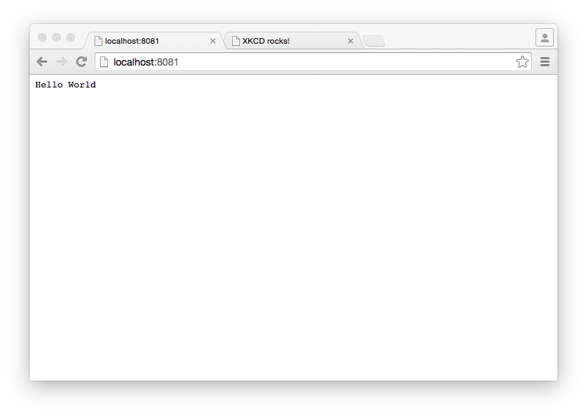

# [Snappy Ubuntu Core](http://developer.ubuntu.com/en/snappy/)

## [Vagrant](http://www.ubuntu.com/cloud/tools/snappy#snappy-vagrant)

```
vagrant init ubuntu/ubuntu-core-devel-amd64
vagrant up
```

- [Vagrantfile](Vagrantfile)
- [login.sh](login.sh)

## Apps

Install

```
sudo snappy install docker
sudo snappy install go-example-webserver
sudo snappy install xkcd-webserver
```

```
ubuntu@localhost:~$ snappy versions
Part                  Tag   Installed  Available  Fingerprint     Active  
ubuntu-core           edge  144        -          395812b6615109  *       
docker                edge  1.3.3.001  -          60b98945e5fc1d  *       
go-example-webserver  edge  1.0.4      -          74c86cd4ed154a  *       
xkcd-webserver        edge  0.3.1      -          3a9152b8bff494  *      
```

## Screenshots

- 

- 
